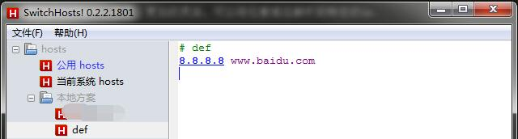
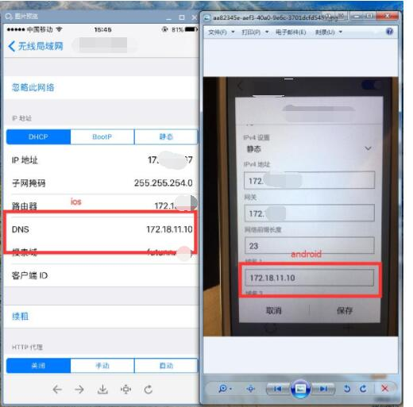

# dns-proxy-server
dns proxy server （dns代理服务器搭建）

dns server depend `os` , `dns` , `dgram` module on  Node.js environment。use `dgram` module create proxy server , 
`lookup()` function  and `resolve4()` funtion will be resolve domain to ipv4. 
dns proxy server depend on operation system configuration files (e.g. `/etc/hosts` or `hosts`).

### why
you to develop a program on your computer. want to test on mobile phones. 
you should running `dnsproxy` in the computer ,and change mobile `dns` to the computer `ipv4`.

在开发阶段，我们总是会在不同的机器上部署不同的服务。假如你有一台电脑，有一台手机。你想使用手机访问电脑上的服务或者是其它服务（在hosts里面配置了域名解析），那么可以在电脑上执行`dnsproxy ip`来启动dns代理，然后将手机的dns解析ip设置为电脑的ip。（前提条件是在同一个局域网内）。

> 配合[SwitchHosts](https://github.com/oldj/SwitchHosts)使用，更加的灵活。可以将任意域名解析到特定的ip.

```
 npm install dns-proxy-server -g
```

### cmd

```
  dnsproxy[ ip[ port]]
```

代理的ip请勿使用`127.0.0.1` 或者虚拟ip。请使用真实对外ip.


配置dns解析的host:




手机dns解析配置：



这样就可以把手机的dns解析到电脑上了。想把指定域名代理到不同ip可以随意配置。就如上面可以把`www.baidu.com`解析到`8.8.8.8` ip上。

### arguments

* `ip` : ipv4 address , default depend on system.
* `port`: dns server bind the port if provide, default `53`.

### ttl(Time To Live)

* `local hosts` : `1` second;
* `net dns` : `30` seconds.

### example

```
 dnsproxy
 //or
 dnsproxy  8.8.8.8
 //or
 dnsproxy 8.8.8.8 53
```


### MAC
please use `sudo`.

eq:
```
 sudo dnsproxy
```